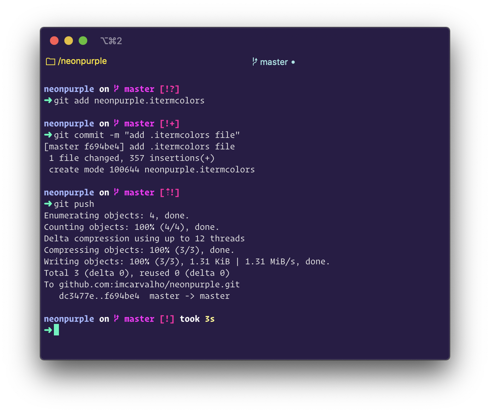

# Neon Purple

A Neon Purple terminal theme, matching the [VS Code theme Noctis Uva](https://marketplace.visualstudio.com/items?itemName=liviuschera.noctis) + [Synthwave '84 custom CSS](https://marketplace.visualstudio.com/items?itemName=RobbOwen.synthwave-vscode).

If, like me, you love the synthwave aesthetic and over the top colors while coding, I think you'll enjoy this theme as well ❤️

I'm also using the [Spaceship promt](https://github.com/denysdovhan/spaceship-prompt) with the Minimal theme on iTerm2 enabled.

## iTerm2

- Download [neonpurple.itermcolors](https://github.com/imcarvalho/neonpurple/releases/download/1.1/neonpurple.itermcolors).
- Launch iTerm
- Type CMD+i
- Navigate to Colors tab
- Click on Load Presets
- Click on Import
- Select the .itermcolors file
- Click on Load Presets and choose a color scheme

## Colors

| Color      | Normal                                                                                                            | Bright                                                                                                            |
| ---------- | ----------------------------------------------------------------------------------------------------------------- | ----------------------------------------------------------------------------------------------------------------- |
| Black      |  #000000 |  #A8FCFF |
| Red        |  #CD0D76 |  #FF0EA5 |
| Green      |  #09EAA5 |  #00FFB7 |
| Yellow     |  #FFFA69 |  #FEF787 |
| Blue       |  #05BEFF |  #18CCFC |
| Magenta    |  #FF00E0 |  #FF00F8 |
| Cyan       |  #9AA5ED |  #A6B5FF |
| White      |  #FFFFFF |  #FFFFFF |
| Foreground |  #E5E5E6 |                                                                                                                   |
| Background |  #291B47 |                                                                                                                   |
| Bold       |  #FFFFFF |                                                                                                                   |
| Selection  |  #C1DDFF |                                                                                                                   |
| Links      |  #005CBB |                                                                                                                   |
